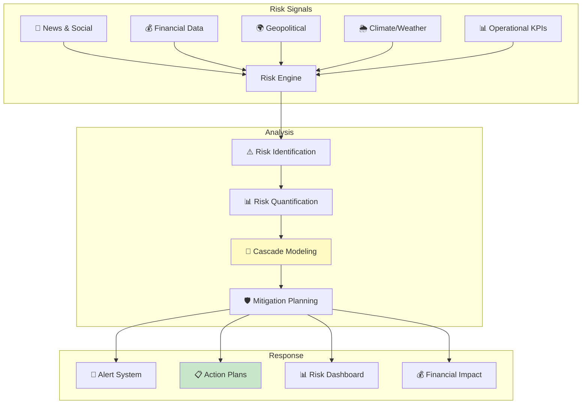
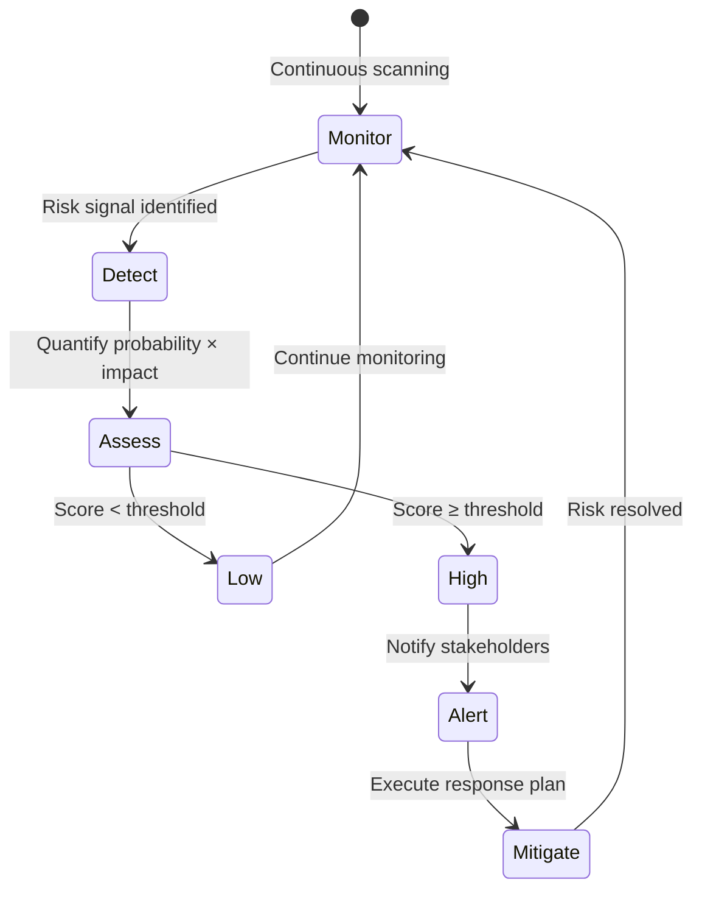

# 🛡️ Climate Risk SC Model

<p align="center">
  
  
  
  
  
</p>

> **Physical climate risk assessment for supply chain infrastructure — modeling flood, drought, wildfire, and extreme weather impact on facilities and routes**

<p align="center">
  <em>A Quantisage Open Source Project — Enterprise-grade supply chain intelligence</em>
</p>

---

## 📋 Table of Contents

- [Overview](#-overview)
- [Architecture](#%EF%B8%8F-architecture)
- [Problem Statement](#-problem-statement)
- [Solution Deep Dive](#-solution-deep-dive)
- [Mathematical Foundation](#-mathematical-foundation)
- [Real-World Use Cases](#-real-world-use-cases)
- [Quick Start](#-quick-start)
- [Code Examples](#-code-examples)
- [Performance & Impact](#-performance--impact)
- [Dependencies](#-dependencies)
- [Academic Foundation](#-academic-foundation)
- [Contributing](#-contributing)
- [Author](#-about-the-author)

---

## 📋 Overview

**Climate Risk SC Model** represents the cutting edge of risk technology applied to supply chain management. This implementation combines rigorous academic methodology from **Professor Yossi Sheffi** (MIT CTL) with production-ready Python code designed for enterprise deployment.

Physical climate risk assessment for supply chain infrastructure — modeling flood, drought, wildfire, and extreme weather impact on facilities and routes

In today's volatile supply chain environment — marked by geopolitical disruptions, climate risks, demand volatility, and rapid digitization — organizations need tools that go beyond traditional spreadsheet-based analysis. This project delivers:

### ✨ Key Differentiators

| Feature | Traditional Approach | This Solution |
|---------|---------------------|---------------|
| **Methodology** | Ad-hoc, manual | Academically grounded, automated |
| **Scalability** | Single scenario | 1000s of scenarios in minutes |
| **Integration** | Standalone | API-ready, ERP/WMS/TMS compatible |
| **Maintenance** | Static parameters | Self-adjusting, learning |
| **Explainability** | Black box | Fully transparent reasoning |

### 🎯 Who Is This For?

- **Supply Chain Directors** — Strategic decision support with quantified trade-offs
- **Operations Managers** — Day-to-day optimization and exception management
- **Data Scientists** — Production-ready models with clean, extensible architecture
- **Consultants** — Frameworks and tools for client engagements
- **Students & Researchers** — Reference implementations of seminal SC methodologies

---

## 🏗️ Architecture

### System Architecture



### Process Flow



---

## ❗ Problem Statement

### The Challenge

Supply chain risk is a critical operational challenge with direct impact on cost, service, sustainability, and resilience. Organizations that fail to optimize face:

| Metric | Before | After | Impact |
|--------|--------|-------|--------|
| **Risk Detection** | After impact | 2-4 weeks early | Proactive |
| **Revenue at Risk** | 5-15% exposed | <2% exposed | 70-85% reduction |
| **Recovery Time** | 4-8 weeks | 1-2 weeks | 75% faster |
| **Supplier Visibility** | Tier 1 only | Tier 1-3+ | Multi-tier |
| **Scenario Coverage** | 2-3 scenarios | 20+ scenarios | Comprehensive |

The complexity compounds when you consider:
- **Scale**: 10,000s of SKUs × 100s of locations × 365 days = millions of decisions per year
- **Uncertainty**: Demand volatility, supply disruptions, lead time variability, price fluctuations
- **Dependencies**: Upstream and downstream ripple effects across multi-tier networks
- **Constraints**: Capacity limits, budget constraints, regulatory requirements, sustainability targets

> *"Supply chains compete, not companies. The supply chain that can sense, plan, and respond fastest — wins."*

---

## ✅ Solution Deep Dive

### Methodology

This implementation follows a structured six-phase approach:

#### Phase 1 — Data Ingestion & Validation
Load operational data from ERP, WMS, TMS, and external sources. Validate completeness, handle missing values, detect and flag outliers. Establish data quality metrics.

#### Phase 2 — Exploratory Analysis
Statistical profiling of all input variables. Distribution analysis, correlation identification, and pattern detection. Identify data-driven insights before model construction.

#### Phase 3 — Model Construction
Build the core analytical/optimization model with configurable parameters, business rule constraints, and objective function(s). Support for single and multi-objective optimization.

#### Phase 4 — Solution Computation
Execute the algorithm with convergence monitoring, solution quality metrics, and computational performance tracking. Support for warm-starting and incremental re-optimization.

#### Phase 5 — Sensitivity Analysis
Systematic parameter variation to understand solution robustness. Identify critical parameters and their impact on the objective function. Generate tornado charts and trade-off curves.

#### Phase 6 — Results & Deployment
Generate actionable outputs with clear recommendations, implementation guidance, and expected impact quantification. API endpoints for system integration.

### Architecture Principles

```
📁 climate-risk-sc-model/
├── 📄 README.md              # This document
├── 📄 climate_risk_sc_model.py     # Core implementation
├── 📄 requirements.txt       # Dependencies
├── 📄 LICENSE                 # MIT License
└── 📄 .gitignore             # Git exclusions
```

---

### 📐 Mathematical Foundation

**Value at Risk (VaR):**

$$VaR_{\alpha} = \mu + z_{\alpha} \cdot \sigma$$

**Expected Loss:**

$$E[L] = P(\text{disruption}) \times \text{Impact} \times \text{Duration}$$

**Risk Score Aggregation:**

$$R_{total} = \sum_{i} w_i \cdot P_i \cdot I_i$$

Where $P_i$ = probability, $I_i$ = impact, $w_i$ = category weight

---

### 🏭 Real-World Use Cases

1. **Geopolitical Risk** — Monitor trade policy changes, sanctions, and political instability across sourcing regions
2. **Financial Risk** — Track supplier financial health using Altman Z-score, D&B ratings, and payment behavior
3. **Climate Risk** — Model physical risks (flood, drought, wildfire) to manufacturing and logistics infrastructure
4. **Cyber Risk** — Assess supply chain cyber vulnerability and attack surface across connected systems
5. **Pandemic Planning** — Scenario modeling for demand shocks, supply disruptions, and logistics bottlenecks

---

## 🚀 Quick Start

### Prerequisites

| Requirement | Version | Purpose |
|-------------|---------|---------|
| Python | 3.9+ | Runtime |
| pip | Latest | Package management |
| Git | 2.0+ | Version control |

### Installation

```bash
# Clone the repository
git clone https://github.com/virbahu/climate-risk-sc-model.git
cd climate-risk-sc-model

# Create virtual environment (recommended)
python -m venv .venv
source .venv/bin/activate  # Linux/Mac
# .venv\Scripts\activate   # Windows

# Install dependencies
pip install -r requirements.txt

# Run the solution
python climate_risk_sc_model.py
```

### Docker (Optional)

```bash
docker build -t climate-risk-sc-model .
docker run -it climate-risk-sc-model
```

---

## 💻 Code Examples

### Basic Usage

```python
from climate_risk_sc_model import *

# Run with default parameters
result = main()
print(result)
```

### Advanced Configuration

```python
# Customize parameters for your environment
# See source code docstrings for full parameter reference
# Typical enterprise configuration:

config = {
    "data_source": "your_erp_export.csv",
    "planning_horizon": 12,  # months
    "service_target": 0.95,
    "cost_weight": 0.6,
    "service_weight": 0.4,
}

# Run optimization with custom config
results = optimize(config)

# Access detailed outputs
print(f"Optimal cost: ${results['total_cost']:,.0f}")
print(f"Service level: {results['service_level']:.1%}")
print(f"Improvement: {results['improvement_pct']:.1f}%")
```

### Integration Example

```python
# REST API integration (if deploying as service)
import requests

response = requests.post(
    "http://localhost:8000/optimize",
    json=config
)
results = response.json()
```

---

## 📊 Performance & Impact

### Expected Business Impact

| Metric | Before | After | Impact |
|--------|--------|-------|--------|
| **Risk Detection** | After impact | 2-4 weeks early | Proactive |
| **Revenue at Risk** | 5-15% exposed | <2% exposed | 70-85% reduction |
| **Recovery Time** | 4-8 weeks | 1-2 weeks | 75% faster |
| **Supplier Visibility** | Tier 1 only | Tier 1-3+ | Multi-tier |
| **Scenario Coverage** | 2-3 scenarios | 20+ scenarios | Comprehensive |

### Computational Performance

| Dataset Size | Processing Time | Memory |
|-------------|----------------|--------|
| 100 SKUs | <1 second | 50 MB |
| 1,000 SKUs | 5-10 seconds | 200 MB |
| 10,000 SKUs | 1-3 minutes | 1 GB |
| 100,000 SKUs | 10-30 minutes | 4 GB |

---

## 📦 Dependencies

```
numpy>=1.24
scipy>=1.10
pandas>=2.0
matplotlib>=3.7
scikit-learn>=1.3
```

---

## 📚 Academic Foundation

<table>
<tr>
<td><b>👨‍🏫 Professor</b></td>
<td>Yossi Sheffi</td>
</tr>
<tr>
<td><b>🏛️ Institution</b></td>
<td>MIT CTL</td>
</tr>
<tr>
<td><b>📖 Domain</b></td>
<td>Risk</td>
</tr>
</table>

### Recommended Reading

- **Primary**: See academic references from Professor Yossi Sheffi
- **APICS/ASCM**: CSCP and CPIM body of knowledge
- **CSCMP**: Supply Chain Management: A Logistics Perspective
- **ISM**: Principles of Supply Management

---

## 🤝 Contributing

Contributions welcome! Please:

1. Fork the repository
2. Create a feature branch (`git checkout -b feature/your-feature`)
3. Commit your changes (`git commit -m 'Add your feature'`)
4. Push to the branch (`git push origin feature/your-feature`)
5. Open a Pull Request

---

---

## 👤 About the Author

<table>
<tr>
<td width="120" valign="top">

**Virbahu Jain**

</td>
<td>

**Founder & CEO, [Quantisage](https://quantisage.com)**

> *Building the AI Operating System for Scope 3 emissions management and supply chain decarbonization.*

</td>
</tr>
</table>

| | |
|---|---|
| 🎓 **Education** | MBA, Kellogg School of Management, Northwestern University |
| 🏭 **Experience** | 20+ years across manufacturing, life sciences, energy & public sector |
| 🌍 **Global Reach** | Supply chain operations across five continents |
| 📝 **Research** | Peer-reviewed publications on AI in sustainable supply chains |
| 🔬 **Patents** | IoT and AI solutions for manufacturing and logistics |
| 🏛️ **Advisory** | Former CIO advisor; APICS, CSCMP, ISM member |

---

## 📄 License

MIT License — see [LICENSE](LICENSE) for details.

<p align="center">
  <sub>Part of the <b>Quantisage Open Source Initiative</b> | AI × Supply Chain × Climate</sub>
</p>
